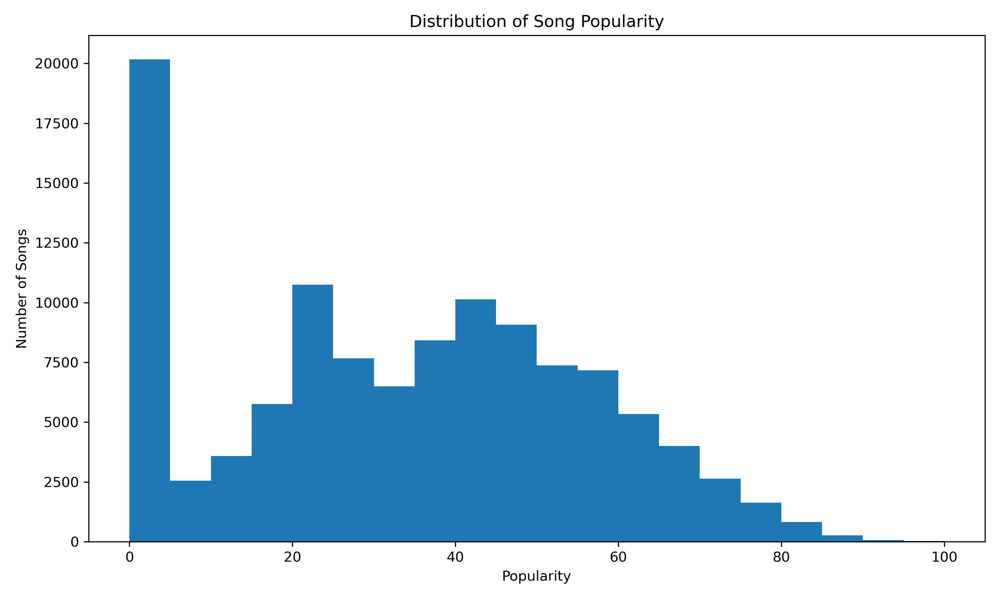
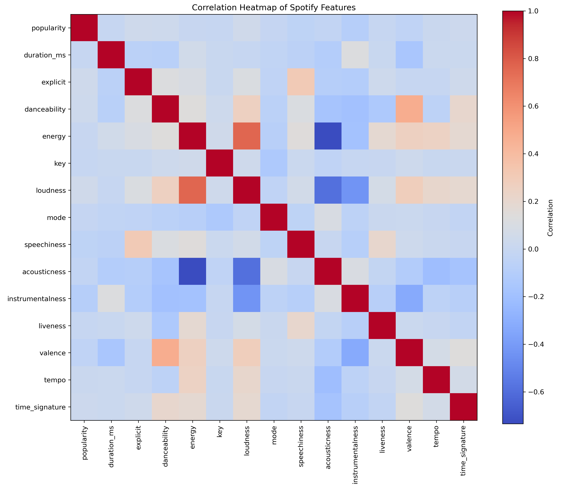
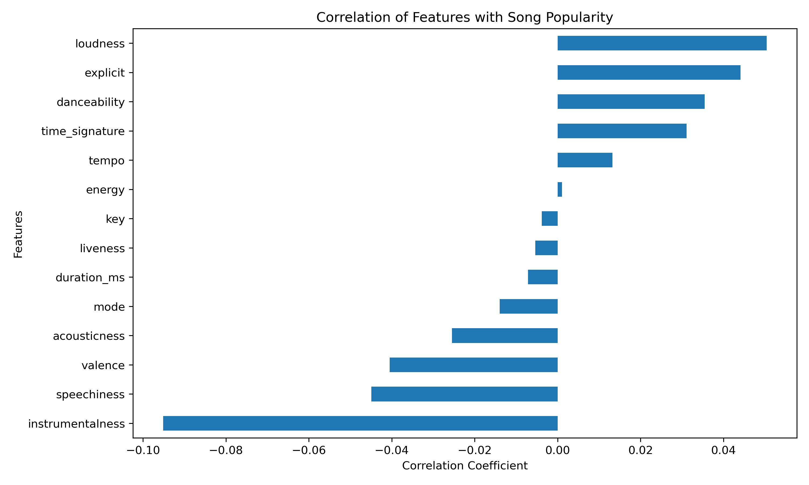
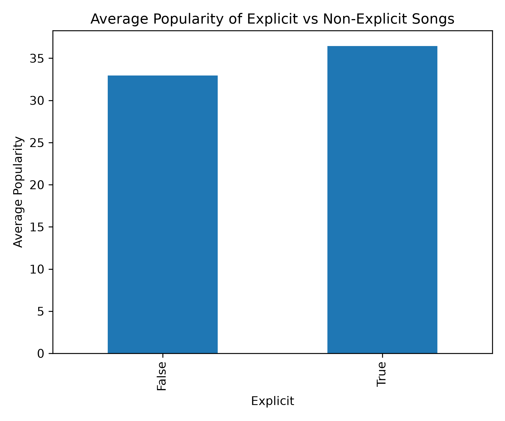

# 🎵 What Makes a Song Popular?

An exploratory data analysis (EDA) project that investigates whether a song's audio characteristics influence its popularity on Spotify using Python, Pandas, and Matplotlib.

---

## 📌 Project Objective

The objective of this project is to explore whether Spotify audio features such as danceability, energy, loudness, acousticness, instrumentalness, tempo, genre, and explicit content have any relationship with song popularity.

---

## 📊 Dataset

| Attribute | Value |
|-----------|-------|
| Total Songs | 113,999 |
| Features | 20 |
| Source | Spotify Songs Dataset |

---

## 🔍 Questions Explored

- Which artists appear most frequently?
- Which genres have the highest average popularity?
- How is song popularity distributed?
- Does danceability influence popularity?
- Does energy influence popularity?
- Are explicit songs more popular?
- Which audio features are most correlated with popularity?

---

# 📈 Visualizations

## Popularity Distribution



---

## Correlation Heatmap



---

## Feature Correlation Ranking



---

## Explicit vs Non-Explicit Songs



---

# 💡 Key Findings

- Most songs have **low to moderate popularity**.
- Approximately **14% of songs** have a popularity score of **0**.
- Only **2 songs** have a popularity score of **100**.
- Loudness has the strongest positive correlation with popularity, although the relationship is weak.
- Instrumentalness has the strongest negative correlation.
- No single audio feature strongly predicts song popularity.

---

# 🛠 Technologies Used

- Python
- Pandas
- NumPy
- Matplotlib
- Jupyter Notebook
- Git
- GitHub

---

# 📂 Project Structure

```
what-makes-a-song-popular/
│
├── data/
├── notebook/
├── notes/
├── visuals/
├── README.md
└── .gitignore
```

---

# 🚀 How to Run

1. Clone this repository.

```bash
git clone https://github.com/swxrli/what-makes-a-song-popular.git
```

2. Install the required libraries.

```bash
pip install pandas numpy matplotlib
```

3. Open the notebook in Jupyter Notebook or VS Code.

4. Run the notebook cells in order.

---

# 📚 Skills Demonstrated

- Exploratory Data Analysis (EDA)
- Data Cleaning
- Data Visualization
- Correlation Analysis
- Statistical Interpretation
- Git Version Control
- GitHub

---

# 🚀 Future Improvements

- Interactive Streamlit Dashboard
- Machine Learning model for popularity prediction
- Interactive filtering by genre and artist

---

## 👤 Author

**Swarali Tambe**

B.Tech Data Science Student
